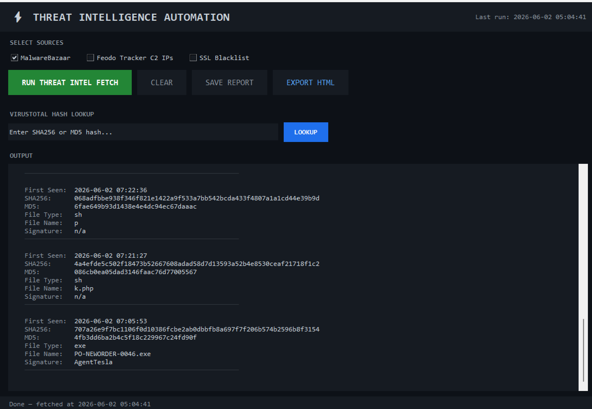
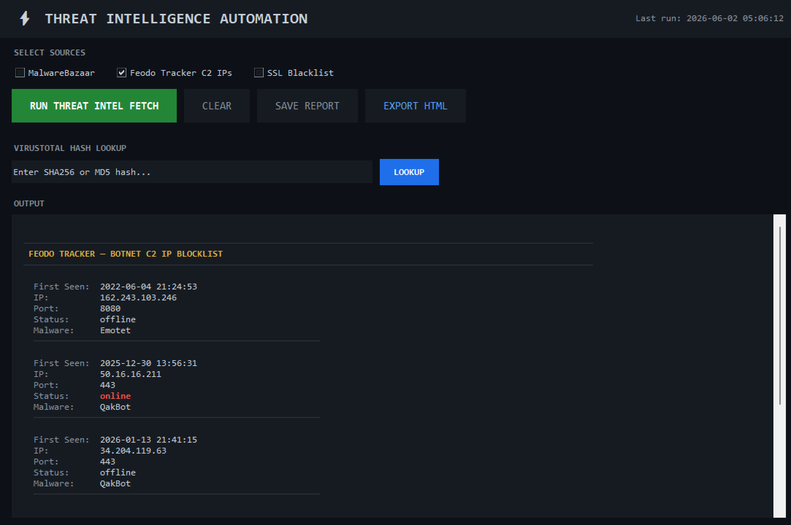
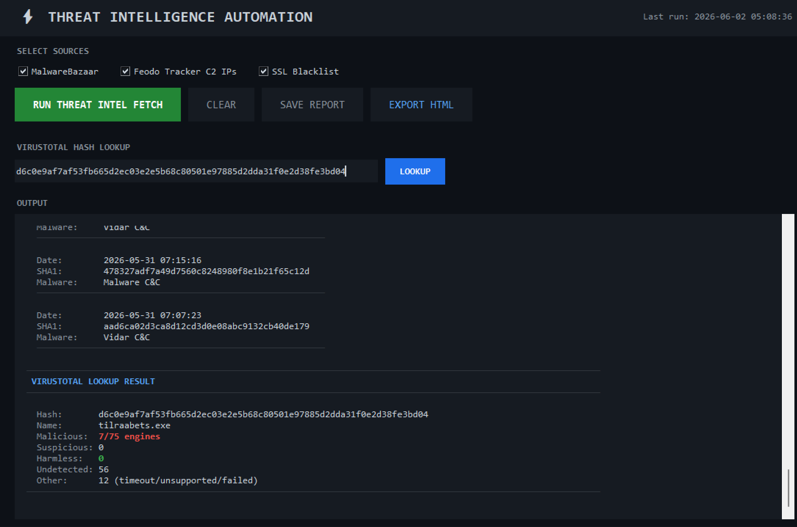
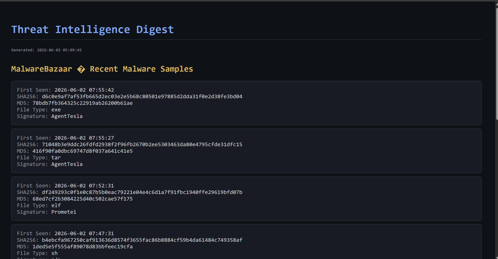

# Threat Intelligence Automation

A Python desktop application that pulls live indicator-of-compromise (IOC) data from public threat intelligence feeds and performs on-demand hash lookups against VirusTotal. It aggregates recent malware samples, active botnet C2 infrastructure, and malicious SSL certificates into a single dark-themed GUI, with plain-text and HTML report export.

Built as a hands-on project to work with real, production threat feeds from abuse.ch and VirusTotal.

## Screenshots

### Main Interface - MalwareBazaar Feed

### Feodo Tracker - Botnet C2 IP Blocklist

### SSL Blacklist - Malicious Certificates

### VirusTotal Hash Lookup

### HTML Export

## Features
- Fetches recent entries from three live abuse.ch feeds, selectable via checkboxes
- VirusTotal hash lookup (MD5 / SHA1 / SHA256) with a full detection breakdown — malicious, suspicious, harmless, undetected, and unresolved — that reconciles to the total engine count
- Input validation on hashes before any API call is made
- Plain-text and styled-HTML report export
- Per-feed timeouts and error handling so a slow or unreachable feed won't hang the app
- Dark-themed tkinter GUI; network calls run on background threads to keep the interface responsive

## Data Sources
- MalwareBazaar (abuse.ch) — recent malware samples with file hashes, file types, and signatures
- Feodo Tracker (abuse.ch) — botnet C2 IP blocklist, including online/offline status and associated malware family
- SSL Blacklist (abuse.ch) — malicious SSL certificate fingerprints tied to C2 infrastructure

## Architecture
- `threat_intel.py` — data layer. Fetches and parses the three feeds and returns plain Python data, with no GUI dependencies.
- `gui.py` — tkinter front end. Imports the fetch functions from `threat_intel.py`, renders results, and handles the VirusTotal lookup and report export.

## Built With
Python 3 · tkinter · requests · VirusTotal API v3

## Note
API keys are kept in a local `config.py` that is excluded from the repository via `.gitignore`. This is a learning/portfolio project — it performs on-demand fetches rather than continuous automated ingestion.
