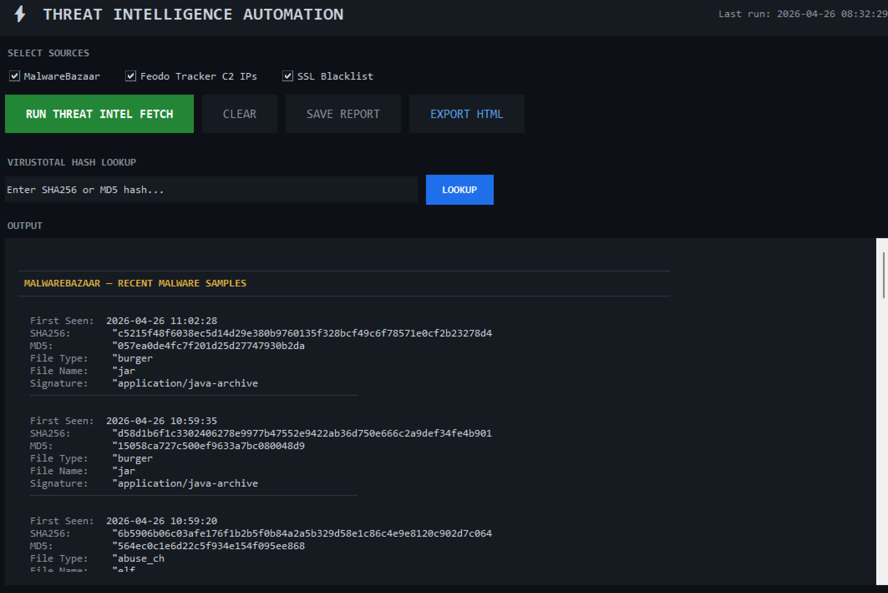
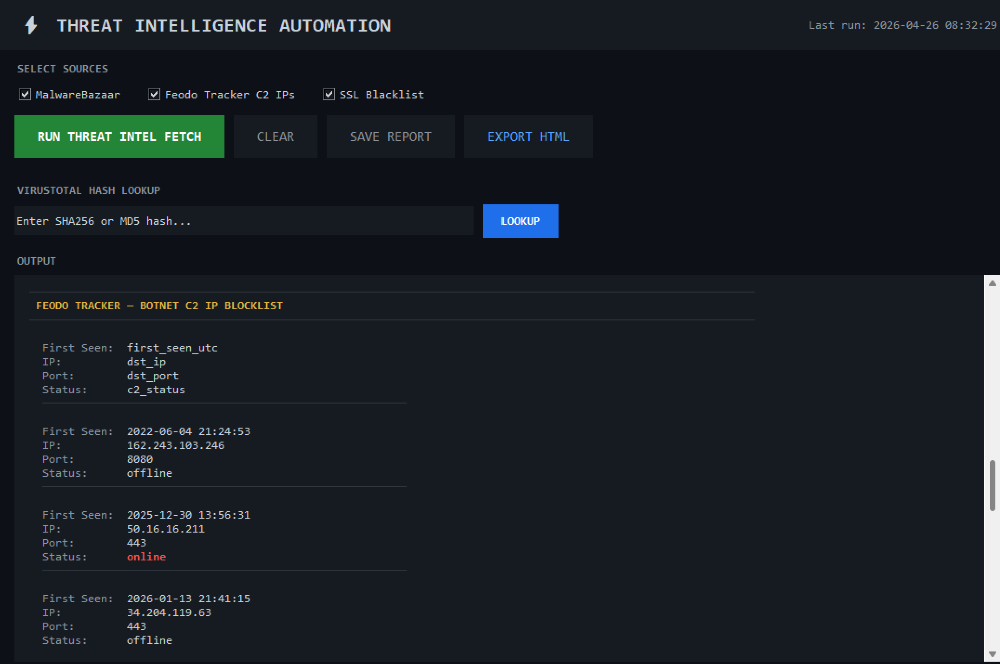
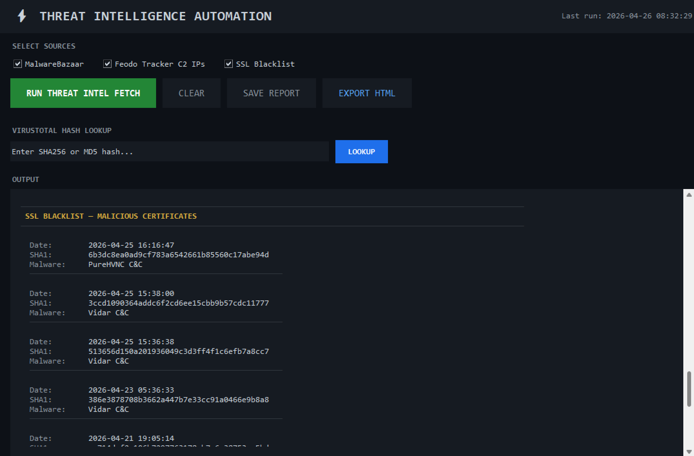
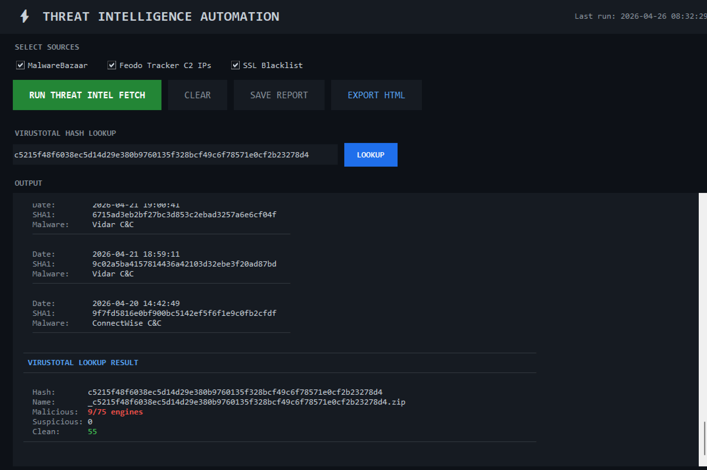
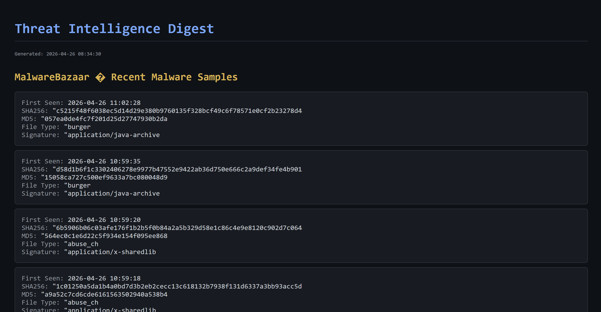

# Threat Intelligence Automation

## Overview
A Python-based threat intelligence automation tool with a dark-themed GUI that pulls live IOC data from multiple free public threat feeds and performs real-time hash lookups against VirusTotal.

Built to simulate the kind of daily threat intel workflows used in real SOC environments.

## Screenshots

### Main Interface - MalwareBazaar Feed

### Feodo Tracker - Botnet C2 IP Blocklist

### SSL Blacklist - Malicious Certificates

### VirusTotal Hash Lookup

### HTML Export

## Features
- Live threat feed ingestion from three sources with no API key required
- Real-time SHA256 and MD5 hash lookup against 75+ AV engines via VirusTotal
- Filter by data source using checkboxes
- Export reports as plain text or styled HTML
- Dark themed professional GUI built with Python tkinter

## Data Sources
- MalwareBazaar (abuse.ch) — recent malware samples with file hashes and signatures
- Feodo Tracker (abuse.ch) — active botnet C2 IP blocklist
- SSL Blacklist (abuse.ch) — malicious SSL certificates including active C&C infrastructure

## Tools Used
- Python 3
- tkinter (GUI)
- requests
- VirusTotal API v3 (free tier)

## Setup
1. Clone the repository
2. Install dependencies: pip install requests
3. Create a config.py file with your VirusTotal API key:
   VT_API_KEY = "your_key_here"
4. Run the GUI: python gui.py

## Note
config.py is excluded from this repository to protect API keys.
Get a free VirusTotal API key at virustotal.com.
